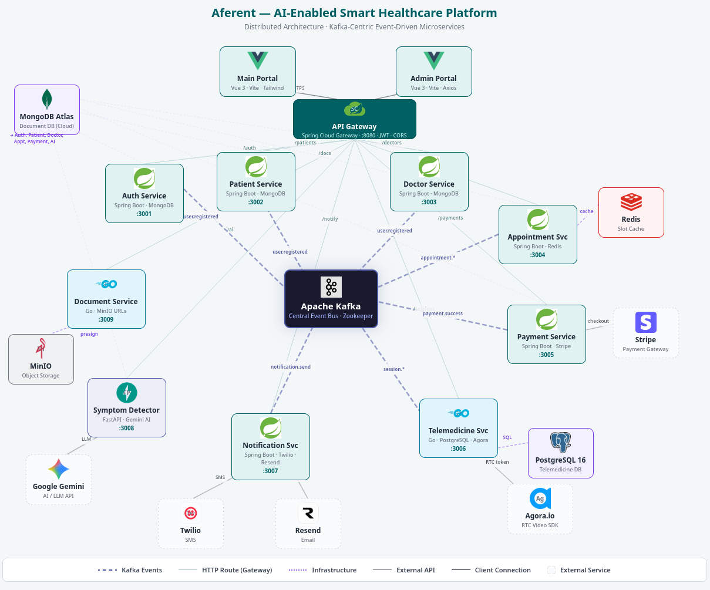

# Aferent — Healthcare Distributed System Monorepo

Aferent is a microservices-based healthcare platform with:
- patient and doctor portals,
- appointment scheduling + payment,
- telemedicine session orchestration,
- document handling via MinIO,
- event-driven integrations over Kafka.

This repository is a **polyglot monorepo** (Java, Go, Python, Vue) that supports both:
- local development with Docker Compose,
- Kubernetes deployment via Kustomize manifests in `k8s/`.

---

## Architecture at a glance

- **API Gateway** (`api-gateway`) is the main entry point (`:8080`).
- **Auth service** issues/validates JWT; gateway forwards identity headers.
- **Domain services** (doctor, patient, appointment, payment, notification, telemedicine, symptom, document) communicate synchronously over HTTP and asynchronously via Kafka.
- **Data stores / infra**:
  - MongoDB Atlas URIs per service (from env variables),
  - PostgreSQL for telemedicine,
  - Redis for appointment-service,
  - MinIO for document/object storage,
  - Kafka + ZooKeeper for eventing.

### Architecture diagram



---

## Monorepo structure

- `client/`
  - `main-portal/` — patient-facing Vue app
  - `admin-portal/` — admin-facing Vue app
- `services/`
  - `api-gateway/` — Spring Cloud Gateway
  - `auth-service/` — authentication + JWT
  - `patient-service/` — patient domain APIs
  - `doctor-service/` — doctor profiles/schedules/prescriptions
  - `appointment-service/` — appointment + slot management
  - `payment-service/` — payment orchestration (Stripe)
  - `notification-service/` — SMS/email notifications
  - `telemedicine-service/` — real-time session lifecycle
  - `document-service/` — MinIO-backed document APIs
  - `symptom-detector/` — AI-assisted symptom analysis
- `k8s/` — Kubernetes manifests (Kustomize)
- `scripts/` — helper scripts (`env-to-secrets.sh`, image push scripts)
- `docker-compose.yml` — local full-stack orchestration

---

## Service summary

| Service | Port | Purpose |
|---|---:|---|
| `main-portal` | 3000 | Main frontend for patient/user flows |
| `admin-portal` | 4000 | Admin frontend |
| `api-gateway` | 8080 | Unified API ingress, JWT guard, CORS handling |
| `auth-service` | 3001 | Login/register/token refresh, identity |
| `patient-service` | 3002 | Patient profile + related workflows |
| `doctor-service` | 3003 | Doctor profile, schedule, specialization/hospital data |
| `appointment-service` | 3004 | Slot browsing, booking, appointment state transitions |
| `payment-service` | 3005 | Payment initiation and status handling |
| `telemedicine-service` | 3006 | Telemedicine sessions and lifecycle events |
| `notification-service` | 3007 | Email/SMS notifications |
| `symptom-detector` | 3008 | AI symptom analysis endpoint |
| `document-service` | 3009 | Presigned upload/download + object metadata |
| `kafka-ui` | 8090 | Kafka topic/consumer inspection UI |
| `nginx` | 80 | Unified edge proxy in local environment |
| `minio` | 9000/9001 | S3 API / MinIO console |
| `postgres-telemedicine` | 5434 | Telemedicine database |


### Significant architectural decisions

- **Gateway-first security model**
  - Authentication is centralized at API Gateway; services rely on forwarded identity headers.
  - Benefit: consistent auth enforcement and less duplicated auth logic in each service.
- **Event-driven workflow for cross-service consistency**
  - Kafka is used for asynchronous domain events (appointments, payments, notifications, storage events).
  - Benefit: looser coupling and resilient multi-step workflows.
- **Polyglot microservices by bounded context**
  - Java/Go/Python services are used where they fit domain/integration needs.
  - Benefit: flexibility, but requires stronger contracts and shared observability.
- **Data-store-per-concern**
  - MongoDB for service-owned domain data, PostgreSQL for telemedicine sessions, MinIO for documents.
  - Benefit: model fit and scalability; tradeoff is higher operational complexity.
- **Dual deployment model (Compose + K8s)**
  - Docker Compose for local development, Kustomize-based manifests for Kubernetes.
  - Benefit: fast local onboarding with a clear path to cluster deployment.

---

## Prerequisites

### For Docker Compose
- Docker Desktop (or Docker Engine)
- Docker Compose v2
- `cloudflared` (optional, required if you expose local services through Cloudflare Tunnel)

### For Kubernetes
- Kubernetes cluster (e.g., Minikube, Kind, or managed K8s)
- `kubectl`
- Kustomize support (`kubectl apply -k ...`)
- If using Minikube ingress manifests: `minikube addons enable ingress`

### For helper scripts
- Bash shell for `scripts/*.sh` (Git Bash/WSL on Windows is fine)

### For tunnel / remote webhook testing (optional)
- Cloudflare account
- `cloudflared` CLI installed and authenticated

---

## Environment setup

1. Copy template env file:

```bash
cp .env.example .env
```

2. Fill real values in `.env`:
- Mongo URIs,
- JWT secret,
- MinIO credentials,
- Stripe key,
- Twilio/Gmail credentials,
- Agora and Gemini credentials.

> `docker-compose.yml` consumes many values via `${...}` interpolation. Missing values will result in startup/runtime failures.

---

## Run locally with Docker Compose

### Start everything

```bash
docker compose up --build -d
```

### Start only selected services (example)

```bash
docker compose up --build -d api-gateway doctor-service appointment-service main-portal
```

### Check status

```bash
docker compose ps
```

### Follow logs

```bash
docker compose logs -f api-gateway
```

### Stop stack

```bash
docker compose down
```

### Stop + remove volumes (clean reset)

```bash
docker compose down -v
```

---

## Deploy to Kubernetes

K8s manifests are under `k8s/` and composed via `k8s/kustomization.yaml`.

### 1) Create/update secrets

Option A: manually edit `k8s/secrets.yaml` (base64 values required).

Option B: generate from `.env` using helper script:

```bash
./scripts/env-to-secrets.sh
```

### 2) Apply all manifests

```bash
kubectl apply -k k8s/
```

### 3) Verify resources

```bash
kubectl get all -n aferent
```

### 4) (If needed) apply ingress-native separately

Included by default in root kustomization; if you split environments, ensure these exist:
- `k8s/ingress-native/ingress.yaml`
- `k8s/ingress-native/minio-proxy.yaml`

---

## Health checks and diagnostics

- Gateway health depends on upstream readiness.
- Many services expose actuator or health endpoints (for example auth/doctor/notification).
- Kafka UI: `http://localhost:8090`
- MinIO console: `http://localhost:9001`

Use:

```bash
docker compose ps
docker compose logs -f <service-name>
```

## Troubleshooting quick list

- Service not reachable through gateway:
  - verify route in `api-gateway` and container health.
- CORS issues:
  - validate gateway CORS config and dedupe headers.
- Missing env value errors:
  - compare `.env` against `.env.example`.
- K8s secret mismatch:
  - regenerate/verify base64 values and re-apply manifests.

---

## Related docs

- `services/*/README.md` for service-level details.
- `database-scripts/README.md` for DB script usage.
- API endpoint markdown files in service folders (where present).
